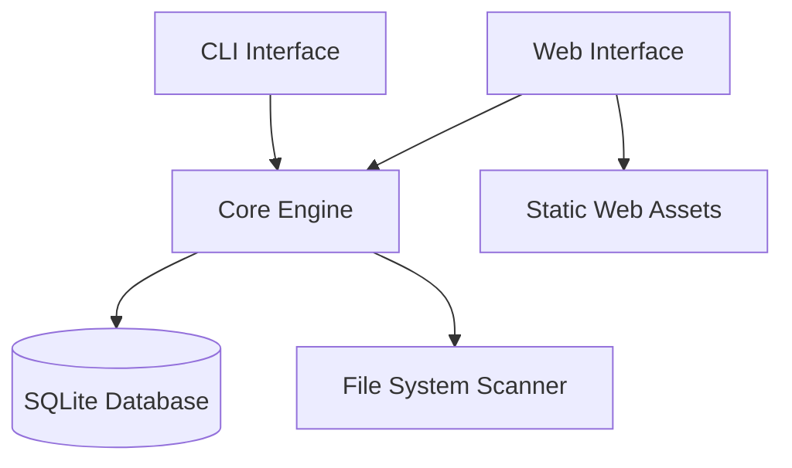

# File Categorizer System Design

## Overview

The File Categorizer System is a dual-interface application that provides both CLI and web-based access to file scanning, categorization, and management functionality. The system uses SQLite for persistent storage and is built primarily with Python for the core functionality and CLI, with a lightweight web interface using Flask for the web component.

## Architecture

### High-Level Architecture



### Component Structure

- **CLI Interface**: Command-line tool using Click for argument parsing and rich for output formatting
- **Web Interface**: Flask server with Jinja2 templates serving a lightweight HTML/CSS/JS frontend
- **Core Engine**: Python business logic layer handling file operations and database interactions
- **File System Scanner**: Python pathlib-based recursive directory traversal with file type detection
- **Database Layer**: SQLite with sqlite3 (built-in) for database operations

## Components and Interfaces

### Core Engine (`src/core/`)

**FileScanner Class**
- `scan_directory(path: Path, options: ScanOptions) -> ScanResult`
- `categorize_file(file_path: Path) -> FileCategory`
- `get_file_metadata(file_path: Path) -> FileMetadata`

**DatabaseManager Class**
- `initialize() -> None`
- `add_file(file_data: FileRecord) -> None`
- `search_files(criteria: SearchCriteria) -> List[FileRecord]`
- `cleanup_database() -> CleanupResult`
- `remove_file(file_id: str) -> bool`

**FileCategory Enum**
- `GRAPHICS`: jpg, jpeg, png, gif, bmp, tiff, webp, ico
- `LIGHTBURN`: lbrn, lbrn2
- `VECTOR`: ai, svg, eps (Inkscape uses svg/eps)

### CLI Interface (`src/cli/`)

**Commands Structure (using Click)**
```bash
python -m file_categorizer scan <directory> [options]
python -m file_categorizer search [query] [options]
python -m file_categorizer list [category] [options]
python -m file_categorizer cleanup [options]
python -m file_categorizer web [--port PORT]
```

**CLI Options**
- `--recursive / --no-recursive`: Enable recursive scanning (default: true)
- `--category, -c`: Filter by category (graphics, lightburn, vector)
- `--format, -f`: Output format (table, json, csv)
- `--dry-run`: Preview cleanup without changes
- `--verbose, -v`: Enable verbose output with progress bars

### Web Interface (`src/web/`)

**Flask Application**
- Static file serving for CSS/JS assets
- Jinja2 templates for HTML rendering
- REST API endpoints for file operations
- Server-Sent Events (SSE) for real-time scan progress

**API Endpoints**
- `GET /api/files`: List files with optional filters
- `POST /api/scan`: Initiate directory scan
- `GET /api/search`: Search files
- `POST /api/cleanup`: Clean up database
- `DELETE /api/files/<id>`: Remove specific file
- `GET /api/progress`: SSE endpoint for scan progress

**Frontend Components**
- File listing table with sorting/filtering using vanilla JS
- Search interface with category filters
- Real-time scan progress using Server-Sent Events
- Cleanup tools with dry-run preview

## Data Models

### FileRecord Dataclass
```python
@dataclass
class FileRecord:
    id: str                    # UUID4 string
    path: str                  # Full file path
    filename: str              # File name only
    category: FileCategory     # Enum value
    size: int                  # File size in bytes
    modified_date: datetime    # Last modified timestamp
    scanned_date: datetime     # When file was discovered
    exists: bool = True        # Current existence status
```

### Database Schema
```sql
CREATE TABLE files (
  id TEXT PRIMARY KEY,
  path TEXT UNIQUE NOT NULL,
  filename TEXT NOT NULL,
  category TEXT NOT NULL,
  size INTEGER NOT NULL,
  modified_date INTEGER NOT NULL,
  scanned_date INTEGER NOT NULL,
  exists INTEGER DEFAULT 1
);

CREATE INDEX idx_category ON files(category);
CREATE INDEX idx_filename ON files(filename);
CREATE INDEX idx_path ON files(path);
```

## Error Handling

### File System Errors
- **Permission Denied**: Log warning and continue scanning other directories
- **File Not Found**: Mark file as non-existent in database during cleanup
- **Network Drives**: Handle timeout and connection issues gracefully

### Database Errors
- **Corruption**: Provide database repair/rebuild functionality
- **Lock Conflicts**: Implement retry logic with exponential backoff
- **Disk Space**: Check available space before operations

### Web Interface Errors
- **Port Conflicts**: Auto-increment port number and retry using Flask's built-in handling
- **Large Result Sets**: Implement pagination using SQLite LIMIT/OFFSET
- **Concurrent Scans**: Use threading locks to prevent concurrent scan operations

## Testing Strategy

### Unit Tests
- File categorization logic with various file extensions
- Database operations (CRUD, search, cleanup)
- File metadata extraction accuracy

### Integration Tests
- CLI command execution and output validation
- Web API endpoint responses and error handling
- Database persistence across application restarts

### Performance Tests
- Large directory scanning (10,000+ files)
- Database query performance with large datasets
- Memory usage during intensive operations

### Manual Testing
- Cross-platform compatibility (Windows, macOS, Linux)
- Web interface usability across browsers
- CLI usability and help documentation

## Implementation Notes

### File Type Detection
- Primary detection via file extension (case-insensitive)
- Fallback to MIME type detection for extensionless files
- Support for compound extensions (.lbrn2, .tar.gz handling)

### Performance Optimizations
- Batch database insertions using executemany() during scanning
- Lazy loading for web interface file lists with pagination
- Configurable scan depth limits using pathlib recursion control
- Progress reporting using rich progress bars and SSE for web

### Security Considerations
- Path traversal protection using pathlib.Path.resolve()
- Input validation for all user-provided paths
- Flask request size limits for web API endpoints
- No execution of discovered files, metadata extraction only

### Deployment
- Python package with entry points for CLI commands
- Minimal dependencies: Click, Flask, Rich for enhanced UX
- Configuration file support using configparser or TOML
- Portable SQLite database file for easy backup/restore
- Optional PyInstaller build for standalone executable